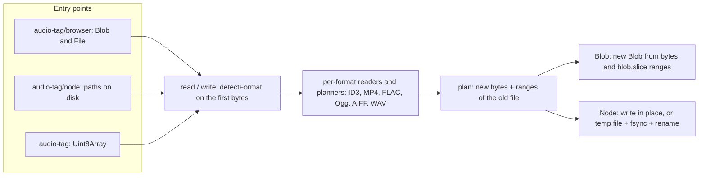

# audio-tag architecture

## Why this design

`audio-tag` reads and writes the tags of MP3, MP4/M4A, FLAC, Ogg, AIFF and WAV files in browsers and in Node.
The core is pure: it parses and serializes `Uint8Array`s and plans writes, and it never touches a file system,
a `Blob` or the network. The platform adapters (`audio-tag/browser`, `audio-tag/node`) are thin edges around it.

A simpler design would load the whole file into memory, edit it and write it all back. That costs as much memory
as the file is long and rewrites the audio on every edit. Instead each writer returns a **plan**: a list of
segments, each either new bytes or a byte range of the old file. The adapters carry the plan out without copying
the audio into memory.

- VERIFIED: the core and the browser entry import no Node built-ins. `npm run lint:platform`
  (`scripts/check-platform.mjs`) checks this on every `make lint`.
- VERIFIED: the package has no runtime dependencies (`package.json` has no `dependencies` field).

## How it works

- VERIFIED: `detectFormat()` (`src/file/detect.ts`) recognises the container from its first bytes. It skips
  leading ID3v2 tags first, because some taggers put them in front of FLAC, Ogg, AIFF and WAV files.
  `read()` and `write()` throw `UnknownFormatError` (`format-unknown`) for anything else.
- VERIFIED: the adapters read through random access (`read(offset, length)`). The Blob adapter
  (`src/platform/blob.ts`) reads with `blob.slice` and builds the written `Blob` from new bytes and slices of
  the original.
- VERIFIED: the Node adapter (`src/platform/file.ts`) writes only the new bytes at their offsets when the plan
  is in place. Otherwise it streams the plan into a temporary file next to the target in 1 MiB chunks, calls
  `fsync` and renames the temporary file over the target. On error it deletes the temporary file.
- VERIFIED: each format maps the shared `metadata` object onto its own structures (`src/*/mapping.ts`).
  `npm run docs:matrix` generates the frame table in `README.md` and `website/data/support.json` (frames,
  field mapping, genres) for the docs page from that code.

## Operations

| Task | Command | What it does |
|---|---|---|
| Install | `make setup` | `npm ci`, then the Chromium build that Playwright drives |
| Lint | `make lint` | type checks for the core, the platform adapters and the tests; the platform check |
| Test | `make test` | vitest in Node and jsdom |
| Coverage | `make coverage` | line coverage of `src/`, printed as `TOTAL <n>%` |
| End to end | `make e2e` | builds and packs the tarball, installs it in a clean consumer under `tmp/e2e/`, runs every high-level read and write function on the files in `input/`, and drives the website in Chromium; results and screenshots go to `output/e2e/` |
| Everything | `make verify` | lint, test, coverage and e2e, as CI runs them |
| Sizes | `make metrics` | builds, then checks each import against its size budget (`scripts/check-size.mjs`) |

- VERIFIED: `.github/workflows/publish.yml` publishes to npm when a `v*` tag is pushed.
  `.github/workflows/pages.yml` builds the website (`website/dist/`, see [`website/ARCH.md`](website/ARCH.md))
  and deploys it to GitHub Pages on every push to `main`.
- The library is not a service, so `make start`, `stop`, `status` and `log` do nothing.

## Security

- The library parses untrusted bytes. VERIFIED: `src/` has no `eval` or `new Function`. Problems in a file
  become warnings; `strict: true` turns them into `TagReadError`s.
- VERIFIED: writes refuse inputs and options that do not apply to the file's format, such as an ID3 option for
  an MP4 file, instead of ignoring them (`src/api/api.ts`).
- VERIFIED: `scripts/serve.mjs`, the development server that also ships in the package, serves files from the
  package folder only. It refuses paths that resolve outside it with 403, and it listens on `localhost` only, so
  other machines on the network cannot connect.

## Privacy

- VERIFIED: the website loads every file from where it is served and requests nothing from third parties;
  `make e2e` fails if any request leaves the site. The playground reads and writes the chosen file in the
  browser with `audio-tag/browser`; nothing is uploaded.
- VERIFIED: `src/` contains no `fetch`, `XMLHttpRequest`, `WebSocket` or Node network call, and the package
  has no dependencies, so the library itself sends nothing anywhere.
