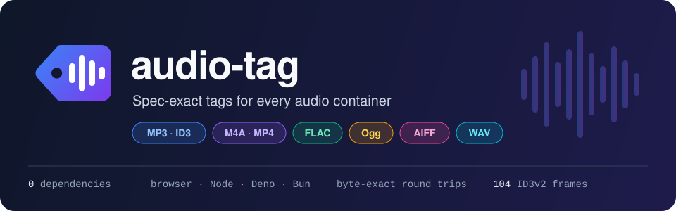
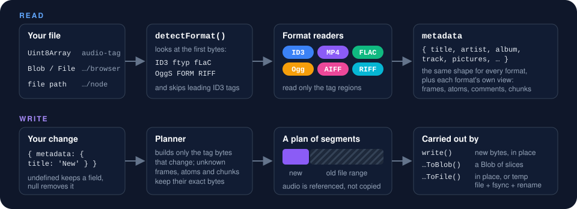
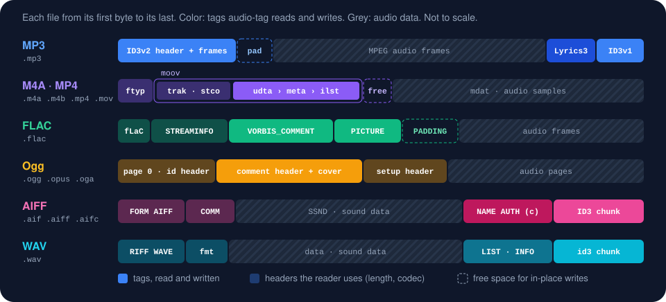

<p align="center">
  
</p>

<p align="center">
  <a href="https://mansi1.github.io/audio-tag/"><b>Website</b></a> ·
  <a href="https://mansi1.github.io/audio-tag/docs.html"><b>Docs</b></a> ·
  <a href="https://mansi1.github.io/audio-tag/#playground"><b>Playground</b></a>: try it on your own files in the browser
</p>

<p align="center">
  
  
  
  
  
</p>

Reads and writes the tags of audio files: **every ID3 tag format**, MP4/M4A metadata, FLAC and Ogg
Vorbis comments, and AIFF and WAV chunks, following the specifications in [`spec/`](spec/README.md):

| Format | Read | Write | Spec |
|---|---|---|---|
| ID3v1, ID3v1.1 | ✓ | ✓ | `spec/id3v1`, v2.2 Appendix A |
| ID3v2.2 | ✓ | ✓ | `spec/id3v2/v2.2` |
| ID3v2.3 | ✓ | ✓ | `spec/id3v2/v2.3` |
| ID3v2.4 (header, extended header, footer, restrictions) | ✓ | ✓ | `spec/id3v2/v2.4` |
| Chapters (`CHAP`, `CTOC`) and accessibility (`ATXT`) addenda | ✓ | ✓ | `spec/id3v2/addenda` |
| Lyrics3 v1 and v2.00 | ✓ | ✓ | `spec/lyrics3` |
| Unofficial frames (iTunes `TCMP`/`TSO2`/`TSOC`, `XRVA`, `RGAD`, `iTunNORM`) | ✓ | ✓ | `spec/id3v2/extensions` |
| MP4/M4A: iTunes item list (`ilst`), QuickTime `mdta` metadata, `udta` text | ✓ | ✓ | `spec/mp4` |
| FLAC: Vorbis comments and pictures (RFC 9639) | ✓ | ✓ | `spec/flac` |
| Ogg Vorbis, Opus and FLAC: comment headers, `METADATA_BLOCK_PICTURE` | ✓ | ✓ | `spec/ogg` |
| AIFF / AIFF-C: `ID3 ` chunk, `NAME`/`AUTH`/`(c) `/`ANNO`/`COMT` chunks | ✓ | ✓ | `spec/aiff` |
| WAV: `id3 ` chunk, `LIST`/`INFO` list | ✓ | ✓ | `spec/riff` |

- **No dependencies, and it runs anywhere.** The core uses only `Uint8Array`, so it works the same
  in browsers, Node, Deno, Bun and workers. Blob/File helpers and Node file helpers are separate
  entry points.
- **Exact round trips.** If you read a tag and write it back unchanged, you get identical bytes,
  including unknown, encrypted and oddly encoded frames.
- **Spec-exact.** It covers unsynchronisation (whole-tag in v2.2/v2.3, per-frame in v2.4),
  synchsafe sizes, zlib frame compression (in pure TypeScript), encryption and grouping hooks, data
  length indicators, CRC-32, preservation and read-only flags, tag restrictions, SEEK, update-tag
  merging, appended tags with footers, all frame layouts of all versions, and conversion between
  versions.
- **Strict writer, tolerant reader.** Problems are reported as warnings; `strict: true` turns them
  into errors. It also reads common broken files, such as old iTunes v2.4 frame sizes and junk
  after text terminators.
- **Validation.** `validateID3v2(tag)` checks every rule in the specs and cites the section for
  each problem it finds.

It passes all 274 cases of the official ID3v1/ID3v1.1 test suite (`test/fixtures/id3v1`).

## How it works



Reading only looks at the tag regions, and writing never copies the audio: a write is a plan of new tag bytes and ranges
of the old file, carried out in place when the size stays the same.

## Where the tags live



**MP4/M4A files** (`.m4a`, `.m4b`, `.mp4`, `.mov`) don't use ID3; their tags are metadata atoms.
All the friendly `metadata` fields work the same, except those MP4 has no place for (ratings, play
count), which are rejected. Links (`userUrls`) are stored as freeform atoms with the iTunes URL data
type. When the new metadata fits in the file's free space, the file is rewritten in place. Otherwise
every chunk offset (`stco`/`co64`) is moved, so the audio stays playable.

**FLAC files** keep their tags in a Vorbis comment block (`TITLE=...`, `ARTIST=...`, repeated for
several values) and picture blocks. Field names follow MusicBrainz Picard, as RFC 9639 suggests.
Unchanged blocks keep their bytes, and a write uses the old padding, so it is usually in place.
Ratings, play counts and links (`userUrls`) have no Vorbis name and are rejected. The track length
comes from the streaminfo block.

**AIFF files** keep rich metadata in an `ID3 ` chunk (an ID3v2 tag, as iTunes and other taggers
write it), which is created at the end of the file when missing, so the sound data does not move.
The file's own `NAME`, `AUTH`, `(c) `, `ANNO` and `COMT` chunks are read as fallbacks, and existing
`NAME`/`AUTH`/`(c) ` chunks are kept in step with the ID3 chunk (ASCII only, as the spec requires).

**WAV files** work the same way as AIFF: rich metadata goes in an `id3 ` chunk, added after the
sound data when missing. The file's `LIST`/`INFO` list (`INAM`, `IART`, `IPRD`, `ICMT`, ...) is read
as a fallback, and an existing one is kept in step with the ID3 chunk. Several values are joined
with `"; "` as the RIFF spec does, and INFO text is ISO-8859-1 (or UTF-8 when a `CSET` chunk says
so). The length comes from the `fmt ` and `data` chunks.

**Ogg files** (Vorbis, Opus, and FLAC in Ogg) keep their tags in the codec's comment header, with the
same field names as FLAC; covers are `METADATA_BLOCK_PICTURE` fields. A write rewrites only the
header pages, with new CRCs. When the header needs more pages than before (a large cover), the
following pages are renumbered, which rewrites the whole file. The length comes from the last
page's granule position. Other Ogg codecs (Speex, Theora, ...) throw a `NotImplementedError`.

ID3 tags that some taggers put in front of FLAC, Ogg, AIFF or WAV files are kept on write and noted
on read; the ID3 functions read and write them, and warn (`format-not-id3`) on files without any.

## Install

```sh
npm install audio-tag
```

The package also ships the [website](https://mansi1.github.io/audio-tag/), with the full docs and
the playground, so you can read them offline. Open your installed copy with:

```sh
npx audio-tag --open        # or: yarn audio-tag --open, bunx audio-tag --open
```

It serves on port 5173. To use another port, add `--port`, for example `--port 8080`.

## Usage

Every format has its own functions, and one set handles any file. Pick the one that fits:

| | Bytes (`audio-tag`) | Blob/File (`audio-tag/browser`) | Files on disk (`audio-tag/node`) |
|---|---|---|---|
| Any file | `read` / `write` | `readFromBlob` / `writeToBlob` | `readFile` / `writeFile` |
| ID3 (MPEG audio) | `readID3File` / `writeID3File` | `readID3FromBlob` / `writeID3ToBlob` | `readID3FromFile` / `writeID3ToFile` / `removeID3FromFile` |
| MP4/M4A | `readMP4File` / `writeMP4File` | `readMP4FromBlob` / `writeMP4ToBlob` | `readMP4FromFile` / `writeMP4ToFile` |
| FLAC | `readFLACFile` / `writeFLACFile` | `readFLACFromBlob` / `writeFLACToBlob` | `readFLACFromFile` / `writeFLACToFile` |
| Ogg | `readOggFile` / `writeOggFile` | `readOggFromBlob` / `writeOggToBlob` | `readOggFromFile` / `writeOggToFile` |
| AIFF | `readAIFFFile` / `writeAIFFFile` | `readAIFFFromBlob` / `writeAIFFToBlob` | `readAIFFFromFile` / `writeAIFFToFile` |
| WAV | `readRIFFFile` / `writeRIFFFile` | `readRIFFFromBlob` / `writeRIFFToBlob` | `readRIFFFromFile` / `writeRIFFToFile` |

- **Any file**: the functions check the format with `detectFormat()` and call the matching
  functions for you: `format` is `'mpeg'`, `'mp4'`, `'flac'`, `'ogg'`, `'aiff'` or `'riff'`. Data
  that is no recognised audio format (`'unknown'`: a JPEG, a text file, a bare ID3v1 tag, empty input) throws an `UnknownFormatError`
  (`format-unknown`) and is never changed. Use the ID3 functions for a bare ID3v1 tag. A bare ID3v2
  tag counts as MPEG audio (`'mpeg'`) and is read as one.
- **One format**: use these when you know the format, or want its own result type and options.
  They refuse other formats with an error that says so (`format-mp4` from the ID3 functions,
  `format-not-mp4`, `format-not-flac`, `format-not-ogg`, `format-not-aiff`, `format-not-riff`).
- **Bundle size**: importing only the ID3 functions bundles no code for the other formats (about
  12.3 KB less, minified and gzipped, than `read`).

### Browser

```ts
import { readFromBlob, writeToBlob } from 'audio-tag/browser'

const { format, metadata } = await readFromBlob(file) // reads only the tag regions of large files
console.log(format, metadata.title, metadata.artist, metadata.pictures?.[0])

const updated = await writeToBlob(file, { metadata: { title: 'New title', genre: ['Rock'] } })
// `updated` is a File with the same name and type; the audio is never copied into memory
```

### Node

```ts
import { readFile, writeFile, readID3FromFile, writeID3ToFile, removeID3FromFile } from 'audio-tag/node'

const { metadata } = await readFile('song.m4a')  // MP3, M4A, ...: the format is detected
await writeFile('song.m4a', { metadata: { album: 'Album', track: { no: 1, of: 12 } } })

const { id3v2, id3v1, lyrics3, warnings } = await readID3FromFile('song.mp3')
await writeID3ToFile('song.mp3', { metadata: { title: 'x' } }, { version: 3 })
// rewrites in place when the tag still fits, otherwise through an atomic temp-file rename
await removeID3FromFile('song.mp3', { id3v1: true })
```

### Any runtime (bytes in, bytes out)

```ts
import { read, write } from 'audio-tag'

const result = read(bytes)
switch (result.format) {
  case 'mp4':
    result.mp4                                   // iTunes items, QuickTime metadata, udta
    break
  case 'flac':
    result.flac                                  // Vorbis comment block and pictures
    break
  case 'ogg':
    result.ogg                                   // codec, comment and pictures
    break
  case 'aiff':
    result.aiff                                  // ID3 chunk, text chunks and comments
    break
  case 'riff':
    result.riff                                   // ID3 chunk and INFO list
    break
  default:
    result.id3v2                                 // ID3v2, ID3v1 and Lyrics3 tags and their layout
}
const { bytes: out } = write(bytes, { metadata: { title: 'x' } })
```

`read()` returns a `ReadResult`, narrowed by `format`: an `ID3ReadResult` for `'mpeg'`, or the
`MP4ReadResult`, `FLACReadResult`, `OggReadResult`, `AIFFReadResult` or `RIFFReadResult`.
`write()` takes `metadata` for every format; the format-specific inputs only for their own format:
`id3v2`, `id3v1` and `lyrics3` for ID3 files (`id3v2` is also the ID3 chunk of AIFF and WAV files),
`mp4`, `flac`, `ogg`, `aiff` and `riff` for theirs. Options that do not apply, such as `version` for MP4, FLAC and Ogg files,
are refused (`mp4-id3-option`, `flac-id3-option`, ...) instead of being ignored.

With one format:

```ts
import { detectFormat, readFLACFile, readID3File, readMP4File, writeFLACFile, writeID3File, writeMP4File } from 'audio-tag'

const format = detectFormat(bytes)
if (format === 'mp4') {
  const { metadata, mp4 } = readMP4File(bytes)
  const { bytes: out } = writeMP4File(bytes, { metadata: { title: 'x' } })
} else if (format === 'flac') {
  const { metadata, flac, streamInfo } = readFLACFile(bytes)
  const { bytes: out } = writeFLACFile(bytes, { metadata: { title: 'x' } }, { padding: 4096 })
} else {
  const { metadata, id3v2, id3v1, lyrics3 } = readID3File(bytes)
  const { bytes: out } = writeID3File(bytes, { metadata: { title: 'x' } }, { version: 4 })
}
```

Each build writes `dist/build-info.json`: the version, the git commit, the build time and the byte
sizes of the generated output (each bundle raw and gzipped; the ESM modules, type declarations and
source maps as groups).

### Low-level API

```ts
import { readID3v2, writeID3v2, createTag, createFrame, TextEncoding, convertID3v2, validateID3v2 } from 'audio-tag'

const tag = createTag(4, [
  createFrame('text', 'TIT2', { encoding: TextEncoding.UTF8, values: ['Title'] }),
  createFrame('chap', 'CHAP', {
    elementId: 'ch1', startTime: 0, endTime: 60000, startOffset: 0xffffffff, endOffset: 0xffffffff,
    frames: [createFrame('text', 'TIT2', { encoding: 0, values: ['Intro'] })],
  }),
  createFrame('priv', 'PRIV', { owner: 'me', data: new Uint8Array(100) }, 4, { compression: true }),
])
const issues = validateID3v2(tag)                // [] when valid
const { bytes } = writeID3v2(tag, { padding: 1024, unsynchronisation: true })
const parsed = readID3v2(bytes)                  // { tag, warnings, totalSize }
const { tag: v23 } = convertID3v2(tag, 3)        // TDRC -> TYER/TDAT/TIME, UTF-8 -> UTF-16, ...
```

Every frame type is a discriminated union member (`frame.type`), with fields named as in the spec.
See `src/id3v2/frames/types.ts`.

## Where the specs disagree

The specs contradict themselves in a few places. Each decision is marked with a `// SPEC:`
comment in the code. The main ones:

- The v2.3 `LINK` frame lists a 3-byte frame ID; the reader detects 3 or 4 bytes.
- The Lyrics3v2 page's prose says 1064 bytes and 6-digit field sizes, but its own example uses
  1065 bytes and 5-digit sizes; the example wins.
- Genres 126–147 are only named by the official test suite.
- Apple's QuickTime spec only defines `mdta` metadata. The iTunes `mdir` item list is implemented
  from ExifTool, mutagen, AtomicParsley and Picard (all in `spec/mp4`).
- The spec gives no unit for v2.3 `RVAD`/`EQUA` values, so they are not converted to v2.4
  `RVA2`/`EQU2`.
- RFC 9639 defines no Vorbis comment field names besides the channel mask; the names come from
  MusicBrainz Picard, as the RFC suggests.
- No AIFF spec defines the `ID3 ` chunk; it is implemented as ExifTool documents it, next to the
  spec's own text chunks.
- The RIFF spec says INFO text is ISO 8859-1 unless a `CSET` chunk says otherwise, but many writers
  put UTF-8 there without one; valid UTF-8 is read as UTF-8 with a warning, and ISO 8859-1 is
  written.
- RFC 3533 gives pages on which no packet ends a granule position of -1, while the Vorbis spec says
  header pages have 0; RFC 7845 and RFC 9639 agree with RFC 3533, so header pages get 0, or -1 when
  no packet ends on them.

## Frame support

Generated from the frame registry (`npm run docs:matrix`). n/a means the frame does not exist in that version.

<!-- support-matrix:start -->
| Frame | v2.2 | v2.3 | v2.4 | Source |
|---|---|---|---|---|
| Content group description | `TT1` §4.2.1 | `TIT1` §4.2.1 | `TIT1` §4.2.1 | spec |
| Title/songname/content description | `TT2` §4.2.1 | `TIT2` §4.2.1 | `TIT2` §4.2.1 | spec |
| Subtitle/Description refinement | `TT3` §4.2.1 | `TIT3` §4.2.1 | `TIT3` §4.2.1 | spec |
| Album/Movie/Show title | `TAL` §4.2.1 | `TALB` §4.2.1 | `TALB` §4.2.1 | spec |
| Original album/movie/show title | `TOT` §4.2.1 | `TOAL` §4.2.1 | `TOAL` §4.2.1 | spec |
| Track number/Position in set | `TRK` §4.2.1 | `TRCK` §4.2.1 | `TRCK` §4.2.1 | spec |
| Part of a set | `TPA` §4.2.1 | `TPOS` §4.2.1 | `TPOS` §4.2.1 | spec |
| Set subtitle | n/a | n/a | `TSST` §4.2.1 | spec |
| ISRC (international standard recording code) | `TRC` §4.2.1 | `TSRC` §4.2.1 | `TSRC` §4.2.1 | spec |
| Lead performer(s)/Soloist(s) | `TP1` §4.2.1 | `TPE1` §4.2.1 | `TPE1` §4.2.2 | spec |
| Band/orchestra/accompaniment | `TP2` §4.2.1 | `TPE2` §4.2.1 | `TPE2` §4.2.2 | spec |
| Conductor/performer refinement | `TP3` §4.2.1 | `TPE3` §4.2.1 | `TPE3` §4.2.2 | spec |
| Interpreted, remixed, or otherwise modified by | `TP4` §4.2.1 | `TPE4` §4.2.1 | `TPE4` §4.2.2 | spec |
| Original artist(s)/performer(s) | `TOA` §4.2.1 | `TOPE` §4.2.1 | `TOPE` §4.2.2 | spec |
| Lyricist/Text writer | `TXT` §4.2.1 | `TEXT` §4.2.1 | `TEXT` §4.2.2 | spec |
| Original lyricist(s)/text writer(s) | `TOL` §4.2.1 | `TOLY` §4.2.1 | `TOLY` §4.2.2 | spec |
| Composer | `TCM` §4.2.1 | `TCOM` §4.2.1 | `TCOM` §4.2.2 | spec |
| Musician credits list | n/a | n/a | `TMCL` §4.2.2 | spec |
| Involved people list | n/a | n/a | `TIPL` §4.2.2 | spec |
| Encoded by | `TEN` §4.2.1 | `TENC` §4.2.1 | `TENC` §4.2.2 | spec |
| BPM (beats per minute) | `TBP` §4.2.1 | `TBPM` §4.2.1 | `TBPM` §4.2.3 | spec |
| Length | `TLE` §4.2.1 | `TLEN` §4.2.1 | `TLEN` §4.2.3 | spec |
| Initial key | `TKE` §4.2.1 | `TKEY` §4.2.1 | `TKEY` §4.2.3 | spec |
| Language(s) | `TLA` §4.2.1 | `TLAN` §4.2.1 | `TLAN` §4.2.3 | spec |
| Content type | `TCO` §4.2.1 | `TCON` §4.2.1 | `TCON` §4.2.3 | spec |
| File type | `TFT` §4.2.1 | `TFLT` §4.2.1 | `TFLT` §4.2.3 | spec |
| Media type | `TMT` §4.2.1 | `TMED` §4.2.1 | `TMED` §4.2.3 | spec |
| Mood | n/a | n/a | `TMOO` §4.2.3 | spec |
| Copyright message | `TCR` §4.2.1 | `TCOP` §4.2.1 | `TCOP` §4.2.4 | spec |
| Produced notice | n/a | n/a | `TPRO` §4.2.4 | spec |
| Publisher | `TPB` §4.2.1 | `TPUB` §4.2.1 | `TPUB` §4.2.4 | spec |
| File owner/licensee | n/a | `TOWN` §4.2.1 | `TOWN` §4.2.4 | spec |
| Internet radio station name | n/a | `TRSN` §4.2.1 | `TRSN` §4.2.4 | spec |
| Internet radio station owner | n/a | `TRSO` §4.2.1 | `TRSO` §4.2.4 | spec |
| Original filename | `TOF` §4.2.1 | `TOFN` §4.2.1 | `TOFN` §4.2.5 | spec |
| Playlist delay | `TDY` §4.2.1 | `TDLY` §4.2.1 | `TDLY` §4.2.5 | spec |
| Encoding time | n/a | n/a | `TDEN` §4.2.5 | spec |
| Original release time | n/a | n/a | `TDOR` §4.2.5 | spec |
| Recording time | n/a | n/a | `TDRC` §4.2.5 | spec |
| Release time | n/a | n/a | `TDRL` §4.2.5 | spec |
| Tagging time | n/a | n/a | `TDTG` §4.2.5 | spec |
| Software/Hardware and settings used for encoding | `TSS` §4.2.1 | `TSSE` §4.2.1 | `TSSE` §4.2.5 | spec |
| Album sort order | n/a | n/a | `TSOA` §4.2.5 | spec |
| Performer sort order | n/a | n/a | `TSOP` §4.2.5 | spec |
| Title sort order | n/a | n/a | `TSOT` §4.2.5 | spec |
| Year | `TYE` §4.2.1 | `TYER` §4.2.1 | n/a | spec |
| Date | `TDA` §4.2.1 | `TDAT` §4.2.1 | n/a | spec |
| Time | `TIM` §4.2.1 | `TIME` §4.2.1 | n/a | spec |
| Original release year | `TOR` §4.2.1 | `TORY` §4.2.1 | n/a | spec |
| Recording dates | `TRD` §4.2.1 | `TRDA` §4.2.1 | n/a | spec |
| Size | `TSI` §4.2.1 | `TSIZ` §4.2.1 | n/a | spec |
| User defined text information frame | `TXX` §4.2.2 | `TXXX` §4.2.2 | `TXXX` §4.2.6 | spec |
| Commercial information | `WCM` §4.3.1 | `WCOM` §4.3.1 | `WCOM` §4.3.1 | spec |
| Copyright/Legal information | `WCP` §4.3.1 | `WCOP` §4.3.1 | `WCOP` §4.3.1 | spec |
| Official audio file webpage | `WAF` §4.3.1 | `WOAF` §4.3.1 | `WOAF` §4.3.1 | spec |
| Official artist/performer webpage | `WAR` §4.3.1 | `WOAR` §4.3.1 | `WOAR` §4.3.1 | spec |
| Official audio source webpage | `WAS` §4.3.1 | `WOAS` §4.3.1 | `WOAS` §4.3.1 | spec |
| Official Internet radio station homepage | n/a | `WORS` §4.3.1 | `WORS` §4.3.1 | spec |
| Payment | n/a | `WPAY` §4.3.1 | `WPAY` §4.3.1 | spec |
| Publishers official webpage | `WPB` §4.3.1 | `WPUB` §4.3.1 | `WPUB` §4.3.1 | spec |
| User defined URL link frame | `WXX` §4.3.2 | `WXXX` §4.3.2 | `WXXX` §4.3.2 | spec |
| Involved people list | `IPL` §4.4 | `IPLS` §4.4 | n/a | spec |
| Unique file identifier | `UFI` §4.1 | `UFID` §4.1 | `UFID` §4.1 | spec |
| Music CD identifier | `MCI` §4.5 | `MCDI` §4.5 | `MCDI` §4.4 | spec |
| Event timing codes | `ETC` §4.6 | `ETCO` §4.6 | `ETCO` §4.5 | spec |
| MPEG location lookup table | `MLL` §4.7 | `MLLT` §4.7 | `MLLT` §4.6 | spec |
| Synchronised tempo codes | `STC` §4.8 | `SYTC` §4.8 | `SYTC` §4.7 | spec |
| Unsynchronised lyrics/text transcription | `ULT` §4.9 | `USLT` §4.9 | `USLT` §4.8 | spec |
| Synchronised lyrics/text | `SLT` §4.10 | `SYLT` §4.10 | `SYLT` §4.9 | spec |
| Comments | `COM` §4.11 | `COMM` §4.11 | `COMM` §4.10 | spec |
| Relative volume adjustment | `RVA` §4.12 | `RVAD` §4.12 | n/a | spec |
| Relative volume adjustment (2) | n/a | n/a | `RVA2` §4.11 | spec |
| Equalisation | `EQU` §4.13 | `EQUA` §4.13 | n/a | spec |
| Equalisation (2) | n/a | n/a | `EQU2` §4.12 | spec |
| Reverb | `REV` §4.14 | `RVRB` §4.14 | `RVRB` §4.13 | spec |
| Attached picture | `PIC` §4.15 | `APIC` §4.15 | `APIC` §4.14 | spec |
| General encapsulated object | `GEO` §4.16 | `GEOB` §4.16 | `GEOB` §4.15 | spec |
| Play counter | `CNT` §4.17 | `PCNT` §4.17 | `PCNT` §4.16 | spec |
| Popularimeter | `POP` §4.18 | `POPM` §4.18 | `POPM` §4.17 | spec |
| Recommended buffer size | `BUF` §4.19 | `RBUF` §4.19 | `RBUF` §4.18 | spec |
| Encrypted meta frame | `CRM` §4.20 | n/a | n/a | spec |
| Audio encryption | `CRA` §4.21 | `AENC` §4.20 | `AENC` §4.19 | spec |
| Linked information | `LNK` §4.22 | `LINK` §4.21 | `LINK` §4.20 | spec |
| Position synchronisation frame | n/a | `POSS` §4.22 | `POSS` §4.21 | spec |
| Terms of use | n/a | `USER` §4.23 | `USER` §4.22 | spec |
| Ownership frame | n/a | `OWNE` §4.24 | `OWNE` §4.23 | spec |
| Commercial frame | n/a | `COMR` §4.25 | `COMR` §4.24 | spec |
| Encryption method registration | n/a | `ENCR` §4.26 | `ENCR` §4.25 | spec |
| Group identification registration | n/a | `GRID` §4.27 | `GRID` §4.26 | spec |
| Private frame | n/a | `PRIV` §4.28 | `PRIV` §4.27 | spec |
| Signature frame | n/a | n/a | `SIGN` §4.28 | spec |
| Seek frame | n/a | n/a | `SEEK` §4.29 | spec |
| Audio seek point index | n/a | n/a | `ASPI` §4.30 | spec |
| Chapter | n/a | `CHAP` §3.1 | `CHAP` §3.1 | chapters addendum |
| Table of contents | n/a | `CTOC` §3.2 | `CTOC` §3.2 | chapters addendum |
| Audio-text | n/a | `ATXT` §4 | `ATXT` §4 | accessibility addendum |
| iTunes compilation flag | `TCP` | `TCMP` | `TCMP` | unofficial |
| iTunes album artist sort order | `TS2` | `TSO2` | `TSO2` | unofficial |
| iTunes composer sort order | `TSC` | `TSOC` | `TSOC` | unofficial |
| iTunes title sort order | `TST` | `TSOT` | `TSOT` | unofficial |
| iTunes performer sort order | `TSP` | `TSOP` | `TSOP` | unofficial |
| iTunes album sort order | `TSA` | `TSOA` | `TSOA` | unofficial |
| Experimental RVA2 | n/a | `XRVA` | n/a | unofficial |
| Replay Gain Adjustment | n/a | `RGAD` | `RGAD` | unofficial |
<!-- support-matrix:end -->

## Development

```sh
npm test            # vitest, node + jsdom
npm run typecheck   # the core is checked without DOM types, so it cannot use browser APIs by accident
npm run build       # ESM + CJS + .d.ts
npm run lint:platform && npm run size
npm run docs:matrix # regenerate the frame table here and website/data/support.json for the docs page
npm run site        # build the website into website/dist/ (needs Node 22 or newer and bun)
npm run serve       # build the library and the website, then serve it at http://localhost:5173/
npm run website     # the same, and open the website in the browser
```

The website ([mansi1.github.io/audio-tag](https://mansi1.github.io/audio-tag/), deployed from `main` by
[`.github/workflows/pages.yml`](.github/workflows/pages.yml)) lives in [`website/`](website/README.md): an
overview with a playground, the docs, and a `404.html` for GitHub Pages. It is built with
[defuss](https://github.com/kyr0/defuss) (defuss-ssg) and [defuss-shadcn](https://github.com/kyr0/defuss-shadcn)
into `website/dist/`, which the npm package ships.

Releases are published by GitHub Actions
([`.github/workflows/publish.yml`](.github/workflows/publish.yml)). Versions follow [semver](https://semver.org);
a release candidate is `X.Y.Z-rc.N`. To release:

1. Rename `## Unreleased` in `CHANGELOG.md` to `## X.Y.Z` (or `## X.Y.Z-rc.N`). `make lint` fails while the
   version in `package.json` is not semver or has no notes in `CHANGELOG.md`.
2. `npm version X.Y.Z --no-git-tag-version`, commit on a branch and open a pull request. `main` accepts changes
   only through a pull request whose `verify` check passed; force pushes and deleting `main` are blocked.
3. After the merge, tag the merge commit: `git switch main && git pull && git tag vX.Y.Z && git push origin vX.Y.Z`.

The verify workflow runs `make verify` on the tag. When it passes, it publishes the tarball `make e2e` tested,
as is, to npm with provenance, then creates a GitHub release with that tarball and the changelog section as
notes. A version with a `-` part goes to the npm dist-tag `next` and becomes a GitHub prerelease; any other
version goes to `latest`. npm accepts the upload through
[trusted publishing](https://docs.npmjs.com/trusted-publishers) (OIDC) for this repository's `publish.yml`, so
there is no npm token to manage.

## License

[MIT](LICENSE) © 2026 Michael Mannseicher.

The specifications in [`spec/`](spec/README.md) are copies of third-party documents (id3.org,
Apple, the IETF RFCs, Xiph.Org, Microsoft/IBM, ExifTool, mutagen, Picard and others), converted to
Markdown and kept for reference. So is Martin Nilsson's ID3v1 test suite in `test/fixtures/id3v1`
(free for non-commercial use). None of them are covered by this license; they keep their authors'
terms. They are not part of the npm package.

## Author

This repo is brought to you by:

<table>
  <tbody>
    <tr>
      <td align="center">
        
        <br/>
        <a href="https://github.com/mansi1">Michael Mannseicher</a>
        <br/>
        <a href="https://michael.mannseicher.com">Website</a>
      </td>
    </tr>
  </tbody>
</table>
