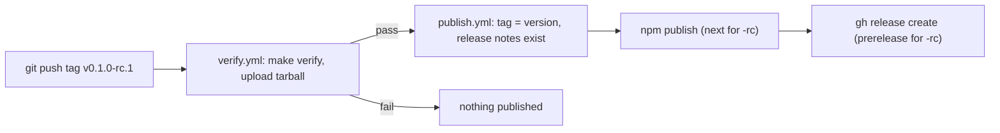

# Plan: semver release candidate on npm and GitHub, docs as `npx|yarn audio-tag`

Goal: publish `audio-tag@0.1.0-rc.1` from the existing tag pipeline, as an npm prerelease (dist-tag `next`) and a
GitHub prerelease with the tested tarball attached; the installed package opens its offline docs with
`npx audio-tag`, `yarn audio-tag` or `bunx audio-tag`.

Tick `- [x]` when a milestone's proof passes, then run `make verify` on its scope.

## Evidence

- VERIFIED: `package.json` is at `0.1.0`, has no `bin`, and its `files` list ships `scripts/serve.mjs` and `website/dist`.
  `scripts/serve.mjs` has no shebang.
- VERIFIED: npm user `mansi1` owns `audio-tag`. A placeholder `0.0.1` (README only) was published by hand on
  2026-10-08 and is `latest`.
- VERIFIED: the human created an npm trusted publisher (OIDC) for GitHub Actions: `Mansi1/audio-tag`, workflow
  `verify.yml`, no environment, direct publishing allowed. The repository has no Actions secrets, and none is
  needed.
- VERIFIED: the repository has no GitHub releases and no tags (`gh release list` prints nothing).
- VERIFIED: `pages.yml` deployed after verify on main (runs 37794595159, 37795862871). The MEMORY line that calls
  it UNKNOWN is stale.
- VERIFIED: `publish.yml` checks that the tag equals `v<version>` and runs `npm publish <tgz> --provenance`
  without `--tag`, so a prerelease version would become `latest`.
- VERIFIED: `CHANGELOG.md` has only an `## Unreleased` section.
- VERIFIED: yarn is not installed on this machine.
- UNKNOWN: whether npm matches the trusted publisher against the calling workflow (`verify.yml`) or the called
  one (`publish.yml`). The first tag run shows it; on an auth error, recreate the publisher with `publish.yml`.
- VERIFIED: trusted publishing needs npm 11.5.1 or newer (npm docs). Node 22 on the runner ships npm 10, and
  npm 12.2.0 is a new major, so the job installs `npm@11` (11.21.0 on 2026-10-08).

## Release flow

A version tag runs verify, and only a passing run publishes the tested tarball to npm and then to GitHub.

## Steps

### M1: the docs open through a `bin`

- [x] `scripts/serve.mjs`: add `#!/usr/bin/env node` as the first line. Update the usage comment to
  `npx audio-tag [--port 8080] [--open]`.
- [x] `package.json:bin`: add `{ "audio-tag": "scripts/serve.mjs" }`. The bin has the package's name, so
  `npx audio-tag` and `bunx audio-tag` run it without `--package`.
  VERIFIED: `yarn audio-tag` runs it in yarn 1.22.22 and yarn 4.5.3 (node_modules and Plug'n'Play, served from the
  zip cache) BC the probe below returned 200 for the start page, docs and library on 2026-10-08.
- [x] `scripts/e2e.mjs:serve`: start the installed copy as a user would, with
  `consumer/node_modules/.bin/audio-tag --port 5291`, the link that npx, yarn and bunx resolve, instead of
  `node scripts/serve.mjs` in the installed folder. Spawning the link itself, not `npm exec`, keeps SIGTERM on
  the server process. The repository server (port 5292, through `PORT`) stays as it is. The existing Chromium run over every
  page then covers the bin.
- Proof: `make e2e` passes; the bin starting at all proves the link, the shebang and the executable bit.
- Probe, not a gate step (yarn is not installed): in an empty project outside the repository (inside it, yarn 1
  refuses the repository's `packageManager: npm`), `yarn add <tgz>`, `yarn audio-tag --port 5293`, then `curl`
  the start page and docs.
- Docs: in `README.md` (install section), `website/lib/pages/docs.tsx`, `CHANGELOG.md` and `ARCH.md`, replace `node node_modules/audio-tag/scripts/serve.mjs --open` with `npx audio-tag --open`
  and give the yarn and bun forms. Explain the choice: package managers resolve a bin by name, while a path into
  `node_modules/` does not exist under Yarn PnP.

### M2: every version has release notes (semver discipline)

- [x] `scripts/release-notes.mjs` (new, about 20 lines): read `package.json:version`, print the body of
  `## <version>` from `CHANGELOG.md`, and exit 1 when that section is missing or the version is not
  `MAJOR.MINOR.PATCH[-PRERELEASE]`. Use the semver regex from semver.org, with no new dependency.
- [x] `Makefile:lint`: add `node scripts/release-notes.mjs > /dev/null`. The invariant "the current version has a
  changelog section" then holds on every commit, not only on tag pushes.
- [x] `CHANGELOG.md`: rename `## Unreleased` to `## 0.1.0-rc.1`. `package.json` and `package-lock.json`
  get `0.1.0-rc.1` through `npm version 0.1.0-rc.1 --no-git-tag-version`.
- Proof: `make lint` passes, and `test/release-notes.node.test.ts` covers the printed section and each failure
  (missing section, empty section, non-semver version) on temporary files.
- Docs: the README "Releases" section describes the flow. Edit `## Unreleased` while working. To release, rename
  it to `## X.Y.Z[-rc.N]`, run `npm version X.Y.Z[-rc.N] --no-git-tag-version`, commit, then
  `git tag vX.Y.Z[-rc.N] && git push origin <tag>`. Proposed policy, for you to confirm: before 1.0, a breaking change bumps the minor version (semver itself
  allows any change in 0.x).

### M3: the tag publishes an npm prerelease and a GitHub release

- [x] `.github/workflows/publish.yml`:
  - add `actions/checkout@v4` so the job has `CHANGELOG.md` and the script.
  - Run `node scripts/release-notes.mjs > notes.md` before publishing; it fails before anything goes out.
  - Install `npm@11`. Set the dist-tag to `next` when the version contains `-`, else `latest`. Run
    `npm publish <tgz> --access public --ignore-scripts --tag "$DIST_TAG"`; with OIDC npm adds provenance
    itself, and the `NPM_TOKEN` secret and `NODE_AUTH_TOKEN` go away (also from `verify.yml`).
  - After npm, run `gh release create "$GITHUB_REF_NAME" audio-tag-*.tgz --verify-tag --title "$GITHUB_REF_NAME" --notes-file notes.md`,
    plus `--prerelease` when the version contains `-`. Set `GH_TOKEN: ${{ github.token }}`.
  - `permissions.contents: write`, `id-token: write`.

  Order: npm first. A failed GitHub release can be re-run by hand (`gh release create`), but npm never accepts a
  version twice.
- [x] `.github/workflows/verify.yml:publish`: `permissions.contents: write` (a called workflow cannot hold more
  than its caller grants).
- Proof: no local runner (MEMORY: no act/actionlint). The proof is the tag run itself, M4.
  `npx -y @action-validator/cli` accepts both files; actionlint did not run (no Go, Docker/Podman not started).

### M4: release candidate (human actions marked 👤)

- [x] 👤 Create the npm trusted publisher (done 2026-10-08).
- [ ] `make verify` passes locally, then commit M1–M3.
- [ ] `git tag v0.1.0-rc.1 && git push origin main v0.1.0-rc.1`. Report the run URL and do not wait (AGENTS.md).
- [ ] Afterwards, check `npm view audio-tag dist-tags` (expect `next: 0.1.0-rc.1`, `latest: 0.0.1`) and `gh release view v0.1.0-rc.1` (prerelease,
  `.tgz` attached). Then run `npx -y audio-tag@next --open` in an empty folder.
- [ ] `.agents/MEMORY.md`: replace the stale UNKNOWN line about pages.yml/publish.yml with the observed result.

## Risk

- `latest` stays on the placeholder `0.0.1` until `0.1.0`; `npm install audio-tag` gets an empty package until
  then. Mitigation: `npm deprecate audio-tag@0.0.1 "placeholder, use audio-tag@next"`.
- Rollback: `npm unpublish audio-tag@0.1.0-rc.1` works within 72 h while no other package depends on it; the
  version number stays used. `gh release delete v0.1.0-rc.1 --cleanup-tag`.
