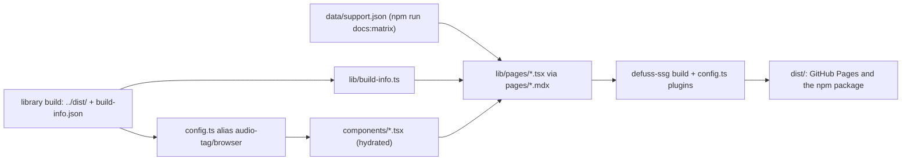

# Architecture: website

The website of audio-tag: an overview with the playground, the docs and a 404 page, rendered at build time
into static files (`dist/`) that GitHub Pages serves and the npm package ships for offline reading. It is
not part of the library: nothing in `src/` depends on it.

## Why this design

- Static pages with islands. Pages are rendered once at build time by defuss-ssg; only the playground and
  the two filterable docs tables are hydrated in the browser. The docs and the overview therefore work
  without JavaScript, and the browser downloads the library (93 KB gzipped, in the playground) only on the
  page that uses it.
- Pages as TSX components. defuss-ssg 0.7.5 builds pages only from `.md`, `.mdx` and `.html` files and skips
  `.tsx` ones (kyr0/defuss#63), so each `pages/*.mdx` holds only the front matter and renders one page
  component from `lib/pages/`. The pages get type checking and shared parts; the alternative, prose in MDX,
  lost both.
- One build of the library. `config.ts` aliases `audio-tag/browser` to the repository's `../dist/browser.js`,
  so the playground runs the same build the package ships, and the footer and docs read that build's
  `dist/build-info.json` through `lib/build-info.ts`.
- No third-party requests. The defuss-shadcn components listed in `lib/ui.ts` are copied from
  `node_modules` into `assets/vendor/` at build time instead of loading the library from a CDN, so the
  offline copy works and no other server sees a visit. Only those components ship (the whole library is
  652 KB of CSS).

## How it works

- `config.ts` plugins, each a workaround for defuss-ssg 0.7.5 behaviour reported upstream:
  `vendor-ui` (pre) copies the UI from `node_modules`; `html-fix` (page-html) adds the doctype (#57), makes
  the hydration URLs page-relative so one build works under `/audio-tag/` and `/website/dist/` (#58), drops
  the per-load cache-bust (#59) and makes `404.html` URLs absolute; `drop-config` (post) removes
  `dist/config.js` (#60).
  `github-pages` (page-html) writes page links without `.html` (`docs.html` → `docs`, `index.html` → `./`,
  `lib/pretty-links.ts`), as GitHub Pages serves them; `scripts/serve.mjs` resolves them the same way
  (a folder serves `index.html`, a path without extension its `.html` file), so the offline copy works too.
  In `dev`, defuss-ssg does not run its page-html plugins; the Vite plugin `github-pages-dev` applies the same
  rewrite in `transformIndexHtml`, which the dev server calls for every page.
  `not-found-dev` answers a missing page route with the 404 page and status 404, as GitHub Pages does; which
  routes are pages, and whether `pages/` has them, is `lib/dev-routes.ts`.
- `lib/head.tsx` sets `window.__defuss_runtime_init` before any island loads, which turns off defuss-ssg's
  client-side navigation: its popstate handler sent in-page `#section` links back to the top (#55), and its
  page morphing does not re-run the head scripts. Links therefore do normal page loads.
- The README diagrams are rendered from `../.github/readme/*.svg` itself, so the README and the site share
  one file per diagram: `lib/themed-svg.ts` turns the dark card's colors into `--dg-*` theme variables and
  prefixes the ids (two diagrams on one page), `lib/svg-tree.ts` splits the markup into elements, and
  `lib/diagram.tsx` renders them as defuss elements. Raw HTML (`dangerouslySetInnerHTML`) is not used,
  since the defuss server renderer cut the SVG off at its `<style>` block.
- `lib/byte-map.ts` is the one owner of "which byte range of a file is what": it turns a read result's
  `layout` into ordered regions covering the whole file; the playground only draws them.

## Operations

- **Configuration and policy:** no runtime configuration. The build needs Node 22 or newer (`uWebSockets.js`
  in defuss-ssg; `scripts/check-node.mjs` stops earlier ones with a message, kyr0/defuss#56) and bun.
  defuss, defuss-ssg and defuss-shadcn are pinned to exact versions, since `config.ts` depends on
  defuss-ssg's output format.
- **Deployment and scaling:** `.github/workflows/pages.yml` builds the library, then `npm run site`, and
  uploads `dist/`; the npm package ships `dist/` without `404.html` and `config.js`.
- **Observability:** none at runtime. `make e2e` drives every page and control in Chromium against the
  installed package and fails on console errors, failed requests and requests to other origins.

## Security and privacy

- Attack surface: static files only. The playground handles the file the visitor picks, in their browser,
  with the library's parsers; nothing is uploaded or stored outside the tab, except the theme choice in
  `localStorage`.
- Privacy: no personal data is processed or sent. The pages request nothing from third parties (checked by
  `make e2e`); links to GitHub are plain links.
